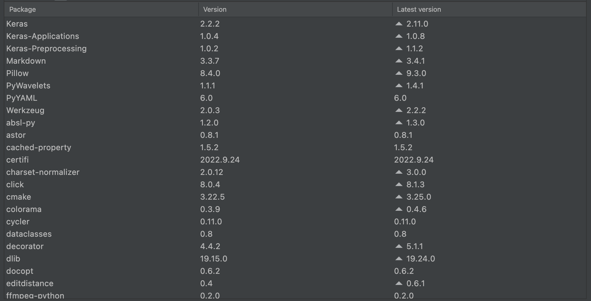
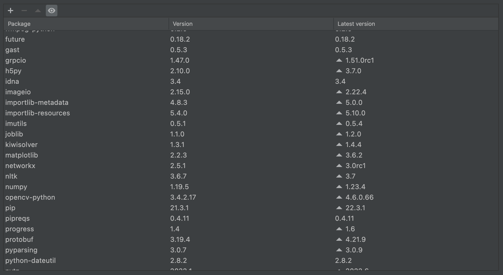
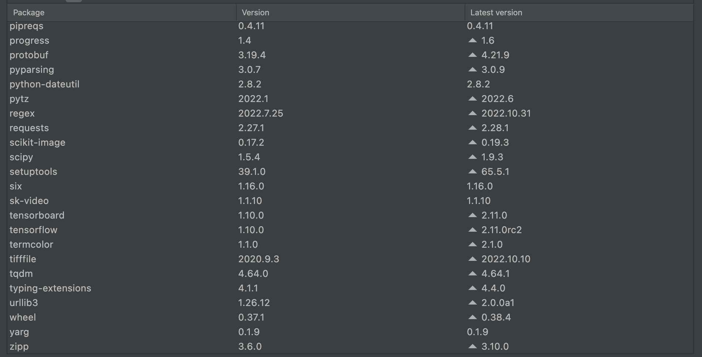

# LipReadingITA

Keras implementation of the method described in the paper 'LipNet: End-to-End Sentence-level Lipreading' by Yannis M. Assael, Brendan Shillingford, Shimon Whiteson, and Nando de Freitas (https://arxiv.org/abs/1611.01599).
Reference - https://github.com/rizkiarm/LipNet


## 1. Getting started

- Python 3.6
- [ffmmpeg](https://www.ffmpeg.org)

### 1.1 Usage

To use the model, first you need to clone the repository:
```
git clone https://github.com/BenedettoSimone/researchProject
```

Then you can install the package:
```
cd researchProject/
pip install -e .
```

Next, install the requirements:

```
pip install -r requirements.txt
```
<br>

If you have some issue, please follow the list of requirements showed in the following images:

<p align="center"></p>
<p align="center"></p>
<p align="center"></p>


## 2. Dataset
In this project we will use an Italian dataset containing the following sentences.


|               Sentence                | ID  |                           Sentence                           | ID  |
|:-------------------------------------:|:---:|:--------------------------------------------------------:|:---:|
|  Salve quanto costa quell' articolo?  |  0  |                   Tutto bene, grazie.                    | 10  |
|     È in offerta, costa 10 euro.      |  1  |                Prendiamo un caffè al bar?                | 11  |
|    Perfetto, vorrei comprarne due.    |  2  |       Certo volentieri, io lo prenderò macchiato.        | 12  |
| Certo ecco a lei, vuole un sacchetto? |  3  |               A che ora arriva il pullman?               | 13  |
|       Sì, grazie e arrivederci.       |  4  |          Dovrebbe arrivare tra qualche minuto.           | 14  |
|     Le auguro una buona giornata.     |  5  |                Quanto costa il biglietto?                | 15  |
|      Buongiorno, io sono Mario.       |  6  | Purtroppo non lo so, però potresti chiedere all’autista. | 16  |
|       Buonasera, io sono Mario.       |  7  |                Va bene, grazie lo stesso.                | 17  |
|       Piacere Luigi, come stai?       |  8  |                          Prego.                          | 18  |
|            Tutto bene, tu?            |  9  |

<br>

### 2.1 Building
For the dataset building, we created a tool to record the videos (https://github.com/BenedettoSimone/Video-Recorder). The videos have a dimension of ``360x288 x 4s``. Use the information provided in the repository and on the main page to replicate our work.
<br><br>After gathering the videos for each subject, we organized the dataset with the following structure.

```
DATASET:
├───s1
│   ├─── 0-bs.mpg
│   ├─── 1-bs.mpg
│   └───...
├───s2
│   └───...
└───...
    └───...
```

Since we need  ``25fps`` videos, and since the experiment was conducted by recording with different devices, we converted the videos to 25fps. To do that we executed the script ``change_fps/change_fps.py``.
After that we replaced, with the newly created videos, the videos in the ``DATASET`` folder.


### 2.2 Forced alignment
Then, we applied for each video the audio and text synchronization (aka forced alignment) using [Aeneas](https://github.com/readbeyond/aeneas). 
<br><br>
After installing Aeneas, we created a copy of dataset and we organized the folder in this way:

```
ForcedAlignment:
│   ├──DatasetCopy:
│       ├───s1
│       │   ├─── 0-bs.mpg
│       │   ├─── 1-bs.mpg
│       │   └───...
│       ├───s2
│       │   └───...
│       └───...
│           └───...
│        
```

Then we followed these steps in the ``terminal``:
1. With the script ``alignment/create_fragments_txt.py``, we created a ``txt`` file for each video following the rules established by Aeneas.
2. With the script ``alignment/autorunAlign.py``, we dinamically created the ``config`` file and we generated the ``align_json`` folder in the ``ForcedAlignment`` folder. 

After running the script the ``ForcedAlignment`` folder will have this structure.

```
ForcedAlignment:
│   ├──DatasetCopy:
│   │   ├───s1
│   │   │   ├─── 0-bs.mpg
│   │   │   ├─── 0-bs.txt
│   │   │   └───...
│   │   ├───s2
│   │       └───...
│   ├──align_json:
│       ├───s1
│       │   ├─── 0-bs.json
│       │   ├─── 1-bs.json
│       │   └───...
│       ├───s2
│       │   └───...   
```


3. As a final step, with the script ``alignment/alignment_converter.py``, we transformed each json file into an ``.align`` file having the following format:
```
0 46000 sil
46000 65000 Perfetto
65000 76000 vorrei
76000 88000 comprarne
88000 92000 due.
92000 99000 sil
```
The first number indicates the start of that word. The second number indicates the stop. Each number represent the frame numbers x 1000. So frames 0-46 are silence, frames 46-65 are the word "Perfetto", etc.

Now we have the ``align`` folder in the ``ForcedAlignment`` folder.

## 3. Mouth extract
Before starting to extract frames and crop the mouth area we insert the ``DATASET`` folder in the project folder and the ``align`` folder in ``Training/datasets/``.

After, we executed the script ``MouthExtract/mouth_extract.py`` that return ``100 frames`` for each video in a new folder ``frames``. 

Finally we split this folder in ``Training/datasets/train`` and ``Training/datasets/val`` using 80% for training phase and 20% for validation phase.

## 4. Training
To train the model we used the script ``Traininig/train.py`` using as a start weights ``Training/results/startWeight/unseen-weights178.h5``. We made 600 epoch splitted in 5 steps. You can see the first five results in ``Training/results``. 

### 4.1 Data augmentation
To reduce overfitting we augmented the dataset with a simple transformation. First we copied the ``Training/datasets/train`` dataset to ``frames``. Then we executed the ``dataAugmentation/flip_image.py`` script, which returns the ``augmented`` folder containing mirror images of the video frames in the ``frames`` folder. 

Next we inserted the video frames from the ``augmented`` folder into ``Training/datasets/train``.

Finally we duplicated the alignments by changing their names (example: ``s10`` to ``a10``). 

After that we trained the model for 400 epochs. 

<i>Note: you can find all start weights used for each training in ``Training/results/startWeight``.</i>

## 5. Prediction
To evaluate the model we used the script ``Predict/predict.py`` placing the video for the prediction phase in the folder ``Predict/PredictVideo``. Since the training phase with the augmented data did not provide good results, we used the weights from the last step of the 600 epochs.

## 6. Installation on Raspberry PI

### 6.1 Install model
Since the model was created to be used on a Raspberry PI device, we created a client server architecture. The client, after recording the video, will send the video to the server, on which the model will be installed, which will do the prediction and send it to the client. This architecture is available in the folder ``LipnetClientServer``.
To use it:
- create the folder ``DATASET/s99`` in ``LipnetClientServer``;
- create the folder ``frames`` in ``LipnetClientServer``;
- copy the ``shape_predictor_68_face_landmarks.dat`` from ``MouthExtract`` in ``LipnetClientServer``;

After that, run the ``LipnetClientServer/server.py`` and finally ``LipnetClientServer/client/client.py``.


### 6.2 Install AudioToText
Install the following packages:
```
pip install SpeechRecognition
```
```
pip install PyAudio
```
```
sudo apt-get install flac
```

## Developed by
[Simone Benedetto](https://github.com/BenedettoSimone) <br>
[Salerno Daniele](https://github.com/DanieleSalerno)
